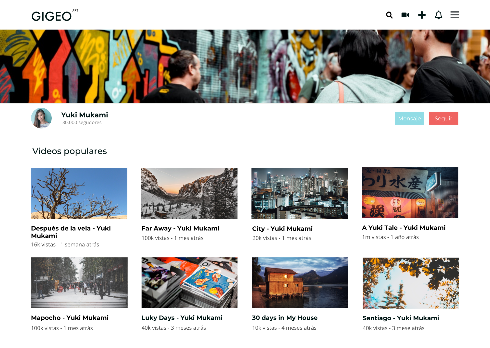
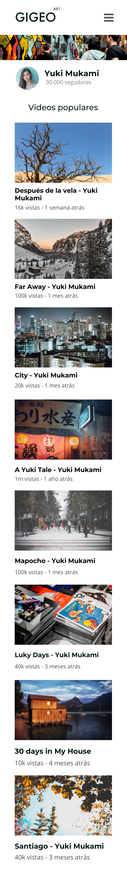

## Desafio "gigeoApp"

|Bootcamp 2022 Modulo 3|Diseño de UI web|
|----|-----|
|**Unidad 1**|Posicionamiento y diseño responsivo|
|**Día Bootcamp**|25|
|**Día Modulo**|3/15|

Esta branch del proyecto corresponde a la versión basada en Bootstrap que solo utiliza CSS Grid en el main que contiene las miniaturas de los videos. El desafío es un pequeño frontend para una app web que servirá de vitrina para creadores audivisuales. Luego del navbar bootstrapiano, y un hero-img, existe un contenedor que permite ver información básica del creador y dos botones para contactarlo. Tiene vistas mobile y desktop, requiere el uso de media queries pero no indica ni viewports ni relaciones de aspecto para el mobile por ejemplo. Se elegirá la más conveniente para presentar adecuadamente el contenido. En este momento, solo me queda la duda de por qué no funcionaron las media queries con la sintaxis anterior (similar a bootstrap). Tuve que indicar ambos valores terminales del rango explícitamente para que funcionaran. 

#### Maqueta desktop

#### Maqueta mobile
